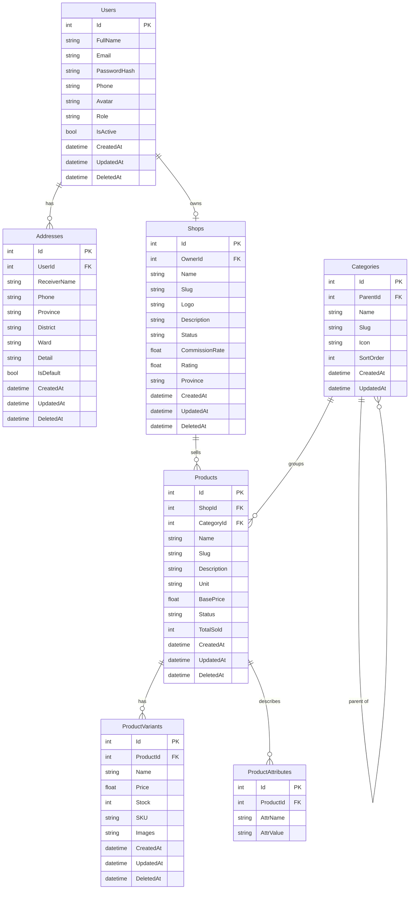
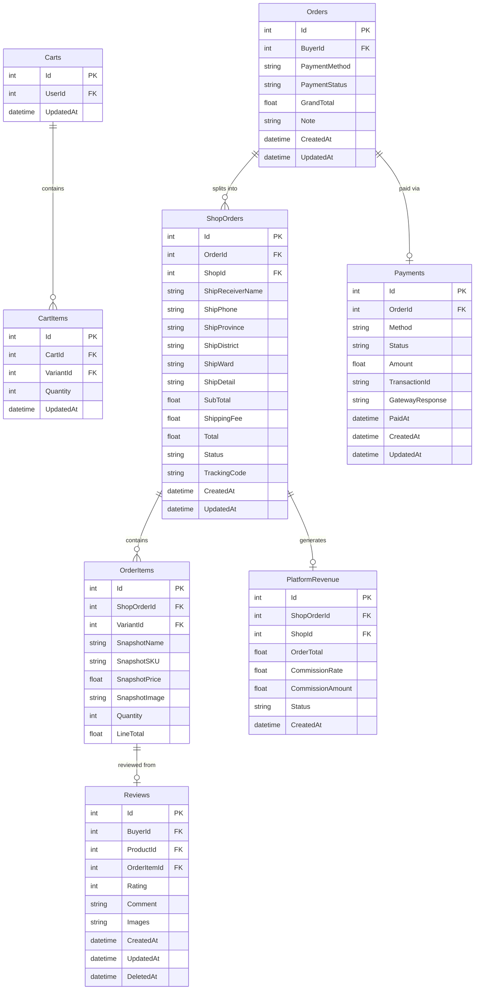

## 1. Sơ đồ User, Shop và Product

```mermaid
erDiagram
  Users {
    int Id PK
    string FullName
    string Email
    string PasswordHash
    string Phone
    string Avatar
    string Role
    bool IsActive
    datetime CreatedAt
    datetime UpdatedAt
    datetime DeletedAt
  }
  Addresses {
    int Id PK
    int UserId FK
    string ReceiverName
    string Phone
    string Province
    string District
    string Ward
    string Detail
    bool IsDefault
    datetime CreatedAt
    datetime UpdatedAt
    datetime DeletedAt
  }
  Shops {
    int Id PK
    int OwnerId FK
    string Name
    string Slug
    string Logo
    string Description
    string Status
    float CommissionRate
    float Rating
    string Province
    datetime CreatedAt
    datetime UpdatedAt
    datetime DeletedAt
  }
  Categories {
    int Id PK
    int ParentId FK
    string Name
    string Slug
    string Icon
    int SortOrder
    datetime CreatedAt
    datetime UpdatedAt
  }
  Products {
    int Id PK
    int ShopId FK
    int CategoryId FK
    string Name
    string Slug
    string Description
    string Unit
    float BasePrice
    string Status
    int TotalSold
    datetime CreatedAt
    datetime UpdatedAt
    datetime DeletedAt
  }
  ProductVariants {
    int Id PK
    int ProductId FK
    string Name
    float Price
    int Stock
    string SKU
    string Images
    datetime CreatedAt
    datetime UpdatedAt
    datetime DeletedAt
  }
  ProductAttributes {
    int Id PK
    int ProductId FK
    string AttrName
    string AttrValue
  }

  Users ||--o{ Addresses : "has"
  Users ||--o| Shops : "owns"
  Shops ||--o{ Products : "sells"
  Categories ||--o{ Categories : "parent of"
  Categories ||--o{ Products : "groups"
  Products ||--o{ ProductVariants : "has"
  Products ||--o{ ProductAttributes : "describes"
```
## 2. Sơ đồ 2Cart, Payment

```mermaid
erDiagram
  Carts {
    int Id PK
    int UserId FK
    datetime UpdatedAt
  }
  CartItems {
    int Id PK
    int CartId FK
    int VariantId FK
    int Quantity
    datetime UpdatedAt
  }
  Orders {
    int Id PK
    int BuyerId FK
    string PaymentMethod
    string PaymentStatus
    float GrandTotal
    string Note
    datetime CreatedAt
    datetime UpdatedAt
  }
  ShopOrders {
    int Id PK
    int OrderId FK
    int ShopId FK
    string ShipReceiverName
    string ShipPhone
    string ShipProvince
    string ShipDistrict
    string ShipWard
    string ShipDetail
    float SubTotal
    float ShippingFee
    float Total
    string Status
    string TrackingCode
    datetime CreatedAt
    datetime UpdatedAt
  }
  OrderItems {
    int Id PK
    int ShopOrderId FK
    int VariantId FK
    string SnapshotName
    string SnapshotSKU
    float SnapshotPrice
    string SnapshotImage
    int Quantity
    float LineTotal
  }
  Payments {
    int Id PK
    int OrderId FK
    string Method
    string Status
    float Amount
    string TransactionId
    string GatewayResponse
    datetime PaidAt
    datetime CreatedAt
    datetime UpdatedAt
  }
  Reviews {
    int Id PK
    int BuyerId FK
    int ProductId FK
    int OrderItemId FK
    int Rating
    string Comment
    string Images
    datetime CreatedAt
    datetime UpdatedAt
    datetime DeletedAt
  }
  PlatformRevenue {
    int Id PK
    int ShopOrderId FK
    int ShopId FK
    float OrderTotal
    float CommissionRate
    float CommissionAmount
    string Status
    datetime CreatedAt
  }

  Carts ||--o{ CartItems : "contains"
  Orders ||--o{ ShopOrders : "splits into"
  ShopOrders ||--o{ OrderItems : "contains"
  Orders ||--o| Payments : "paid via"
  OrderItems ||--o| Reviews : "reviewed from"
  ShopOrders ||--o| PlatformRevenue : "generates"
```
  Orders ||--o{ Reviews : "reviewed from"
  OrderItems ||--o| Reviews : "linked to"
```
