# ERD — Sàn Thương Mại Điện Tử Nông Sản (Multi-Vendor)

> **Đề tài:** Xây dựng website sàn thương mại điện tử đa người bán sử dụng ASP.NET Core và React.js  
> **Phạm vi:** Sản phẩm nông sản (mứt, hạt, kẹo, cà phê, trà...) — định hướng nhà vườn  
> **Tổng số bảng:** 18 bảng | **Công nghệ:** SQL Server / PostgreSQL

---

## Sơ đồ ERD hoàn chỉnh

```mermaid
erDiagram

  %% ══════════════════════════════════════════════
  %% NHÓM 1 — NGƯỜI DÙNG & ĐỊA CHỈ
  %% ══════════════════════════════════════════════
  Users {
    int       Id              PK
    string    FullName
    string    Email
    string    PasswordHash
    string    Phone
    string    Avatar
    string    Role
    bool      IsActive
    datetime  CreatedAt
    datetime  UpdatedAt
    datetime  DeletedAt
  }

  Addresses {
    int       Id              PK
    int       UserId          FK
    string    ReceiverName
    string    Phone
    string    Province
    string    District
    string    Ward
    string    Detail
    bool      IsDefault
    datetime  CreatedAt
    datetime  UpdatedAt
    datetime  DeletedAt
  }

  %% ══════════════════════════════════════════════
  %% NHÓM 2 — GIAN HÀNG & DANH MỤC
  %% ══════════════════════════════════════════════
  Shops {
    int       Id              PK
    int       OwnerId         FK
    string    Name
    string    Slug
    string    Logo
    string    Description
    string    Province
    string    Status
    float     CommissionRate
    float     Rating
    datetime  CreatedAt
    datetime  UpdatedAt
    datetime  DeletedAt
  }

  Categories {
    int       Id              PK
    int       ParentId        FK
    string    Name
    string    Slug
    string    Icon
    int       SortOrder
    datetime  CreatedAt
    datetime  UpdatedAt
  }

  %% ══════════════════════════════════════════════
  %% NHÓM 3 — SẢN PHẨM
  %% ══════════════════════════════════════════════
  Products {
    int       Id              PK
    int       ShopId          FK
    int       CategoryId      FK
    string    Name
    string    Slug
    string    Description
    string    Unit
    float     BasePrice
    string    Status
    int       TotalSold
    datetime  CreatedAt
    datetime  UpdatedAt
    datetime  DeletedAt
  }

  ProductVariants {
    int       Id              PK
    int       ProductId       FK
    string    Name
    float     Price
    int       Stock
    string    SKU
    string    Images
    datetime  CreatedAt
    datetime  UpdatedAt
    datetime  DeletedAt
  }

  ProductAttributes {
    int       Id              PK
    int       ProductId       FK
    string    AttrName
    string    AttrValue
  }

  %% ══════════════════════════════════════════════
  %% NHÓM 4 — NHẬP HÀNG & LÔ HÀNG
  %% ══════════════════════════════════════════════
  ImportOrders {
    int       Id              PK
    int       ShopId          FK
    string    ImportCode
    string    HarvestSeason
    string    SupplierName
    float     TotalCost
    string    Note
    string    DocumentImages
    string    Status
    datetime  ImportedAt
    datetime  CreatedAt
    datetime  UpdatedAt
  }

  ImportOrderItems {
    int       Id              PK
    int       ImportOrderId   FK
    int       VariantId       FK
    string    BatchCode
    int       Quantity
    int       RemainingQty
    float     CostPrice
    datetime  ManufacturedAt
    datetime  ExpiredAt
    string    Status
    datetime  CreatedAt
    datetime  UpdatedAt
  }

  %% ══════════════════════════════════════════════
  %% NHÓM 5 — GIỎ HÀNG
  %% ══════════════════════════════════════════════
  Carts {
    int       Id              PK
    int       UserId          FK
    datetime  UpdatedAt
  }

  CartItems {
    int       Id              PK
    int       CartId          FK
    int       VariantId       FK
    int       Quantity
    datetime  UpdatedAt
  }

  %% ══════════════════════════════════════════════
  %% NHÓM 6 — ĐƠN HÀNG
  %% ══════════════════════════════════════════════
  Orders {
    int       Id              PK
    int       BuyerId         FK
    string    PaymentMethod
    string    PaymentStatus
    float     GrandTotal
    string    Note
    datetime  CreatedAt
    datetime  UpdatedAt
  }

  ShopOrders {
    int       Id              PK
    int       OrderId         FK
    int       ShopId          FK
    string    ShipReceiverName
    string    ShipPhone
    string    ShipProvince
    string    ShipDistrict
    string    ShipWard
    string    ShipDetail
    float     SubTotal
    float     ShippingFee
    float     Total
    string    Status
    string    TrackingCode
    datetime  CreatedAt
    datetime  UpdatedAt
  }

  OrderItems {
    int       Id              PK
    int       ShopOrderId     FK
    int       VariantId       FK
    string    SnapshotName
    string    SnapshotSKU
    float     SnapshotPrice
    string    SnapshotImage
    int       Quantity
    float     LineTotal
  }

  OrderItemBatches {
    int       Id                  PK
    int       OrderItemId         FK
    int       ImportOrderItemId   FK
    int       QuantityUsed
    string    ExpirySnapshot
  }

  %% ══════════════════════════════════════════════
  %% NHÓM 7 — THANH TOÁN & DOANH THU
  %% ══════════════════════════════════════════════
  Payments {
    int       Id              PK
    int       OrderId         FK
    string    Method
    string    Status
    float     Amount
    string    TransactionId
    string    GatewayResponse
    datetime  PaidAt
    datetime  CreatedAt
    datetime  UpdatedAt
  }

  PlatformRevenue {
    int       Id              PK
    int       ShopOrderId     FK
    int       ShopId          FK
    float     OrderTotal
    float     CommissionRate
    float     CommissionAmount
    string    Status
    datetime  CreatedAt
  }

  %% ══════════════════════════════════════════════
  %% NHÓM 8 — ĐÁNH GIÁ & THÔNG BÁO
  %% ══════════════════════════════════════════════
  Reviews {
    int       Id              PK
    int       BuyerId         FK
    int       ProductId       FK
    int       OrderItemId     FK
    int       Rating
    string    Comment
    string    Images
    datetime  CreatedAt
    datetime  UpdatedAt
    datetime  DeletedAt
  }

  Notifications {
    int       Id              PK
    int       UserId          FK
    string    Type
    string    Title
    string    Body
    bool      IsRead
    datetime  CreatedAt
  }

  %% ══════════════════════════════════════════════
  %% QUAN HỆ GIỮA CÁC BẢNG
  %% ══════════════════════════════════════════════

  Users             ||--o{ Addresses         : "has"
  Users             ||--o| Shops             : "owns"
  Users             ||--o| Carts             : "has"
  Users             ||--o{ Notifications     : "receives"

  Shops             ||--o{ Products          : "sells"
  Shops             ||--o{ ImportOrders      : "creates"
  Shops             ||--o{ ShopOrders        : "receives"
  Shops             ||--o{ PlatformRevenue   : "generates"

  Categories        ||--o{ Categories        : "parent of"
  Categories        ||--o{ Products          : "groups"

  Products          ||--o{ ProductVariants   : "has"
  Products          ||--o{ ProductAttributes : "describes"
  Products          ||--o{ Reviews           : "has"

  ProductVariants   ||--o{ CartItems         : "in"
  ProductVariants   ||--o{ ImportOrderItems  : "stocked by"
  ProductVariants   ||--o{ OrderItems        : "ordered as"

  ImportOrders      ||--o{ ImportOrderItems  : "contains"
  ImportOrderItems  ||--o{ OrderItemBatches  : "used in"

  Carts             ||--o{ CartItems         : "contains"

  Orders            ||--o{ ShopOrders        : "splits into"
  Orders            ||--o| Payments          : "paid via"

  ShopOrders        ||--o{ OrderItems        : "contains"
  ShopOrders        ||--o| PlatformRevenue   : "generates"

  OrderItems        ||--o{ OrderItemBatches  : "sourced from"
  OrderItems        ||--o| Reviews           : "reviewed from"
```

---

## Tổng quan các nhóm bảng

| Nhóm | Bảng | Mô tả |
|------|------|-------|
| 1. Người dùng | `Users`, `Addresses` | Tài khoản Buyer / Seller / Admin và sổ địa chỉ |
| 2. Gian hàng | `Shops`, `Categories` | Nhà vườn đăng ký shop, danh mục đa cấp |
| 3. Sản phẩm | `Products`, `ProductVariants`, `ProductAttributes` | Sản phẩm nông sản, biến thể (khối lượng), thuộc tính (vùng trồng...) |
| 4. Nhập hàng | `ImportOrders`, `ImportOrderItems` | Phiếu nhập hàng theo vụ mùa, quản lý hạn sử dụng và giá vốn từng lô |
| 5. Giỏ hàng | `Carts`, `CartItems` | Giỏ hàng của Buyer |
| 6. Đơn hàng | `Orders`, `ShopOrders`, `OrderItems`, `OrderItemBatches` | Tách đơn theo shop, snapshot địa chỉ & giá, xuất kho theo FEFO |
| 7. Tài chính | `Payments`, `PlatformRevenue` | Thanh toán và hoa hồng sàn thu từ mỗi đơn |
| 8. Tương tác | `Reviews`, `Notifications` | Đánh giá (verified purchase), thông báo hệ thống |

---

## Các quyết định thiết kế quan trọng

### 1. Tách `Orders` → `ShopOrders` (Multi-vendor Order)
Một lần checkout tạo **1 `Orders`**, hệ thống tự tách thành nhiều **`ShopOrders`** (1 per shop). Mỗi `ShopOrders` có `Status`, `ShippingFee`, `Total` riêng. Seller chỉ thấy và thao tác trên `ShopOrders` của mình.

### 2. Snapshot địa chỉ trong `ShopOrders`
Không dùng FK tới `Addresses`. Lưu thẳng `ShipProvince`, `ShipDistrict`... vào `ShopOrders` lúc checkout. Buyer sửa/xóa địa chỉ sau không ảnh hưởng đơn cũ.

### 3. Snapshot sản phẩm trong `OrderItems`
`SnapshotName`, `SnapshotPrice`, `SnapshotSKU`, `SnapshotImage` — lưu thông tin sản phẩm tại thời điểm mua. Seller tăng giá sau không làm sai lịch sử đơn hàng.

### 4. Phiếu nhập hàng theo vụ mùa (`ImportOrders`)
Phản ánh đúng thực tế nhà vườn: **1 chuyến nhập = 1 phiếu** gồm nhiều sản phẩm cùng vụ thu hoạch. Mỗi dòng `ImportOrderItems` có `ExpiredAt` và `CostPrice` riêng (vì mứt hết hạn 6 tháng, cà phê 12 tháng).

### 5. FEFO — First Expired, First Out
Khi có đơn hàng, hệ thống tự chọn lô **gần hết hạn nhất** xuất trước. Ghi nhận vào `OrderItemBatches`. Tránh tồn đọng hàng sắp hết date.

### 6. Soft Delete (`DeletedAt`)
Không xóa cứng dữ liệu. Query luôn kèm `WHERE DeletedAt IS NULL`. Giữ toàn bộ lịch sử để audit và báo cáo.

### 7. Hoa hồng sàn (`PlatformRevenue`)
Mỗi `ShopOrders` hoàn thành tự sinh 1 record `PlatformRevenue` ghi nhận `CommissionRate` (snapshot từ `Shops.CommissionRate`) và `CommissionAmount`. Admin thống kê doanh thu sàn = `SUM(CommissionAmount)`.

---

## Ghi chú kỹ thuật

- **Soft delete:** tất cả bảng nghiệp vụ chính đều có `DeletedAt nullable`
- **Audit fields:** mọi bảng đều có `CreatedAt`, hầu hết có `UpdatedAt`  
- **Slug:** `Shops.Slug`, `Products.Slug`, `Categories.Slug` — unique, dùng cho SEO-friendly URL
- **CommissionRate snapshot:** lưu lại trong `PlatformRevenue` để lịch sử không bị ảnh hưởng khi Admin thay đổi tỷ lệ
- **Stock tổng hợp:** `ProductVariants.Stock` = `SUM(RemainingQty)` các lô `Active` — cập nhật mỗi khi nhập/xuất hàng
