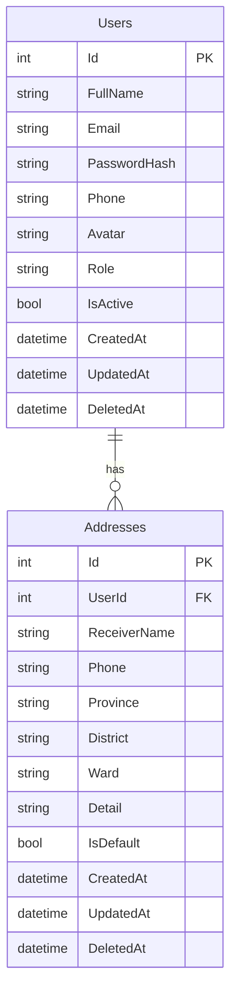
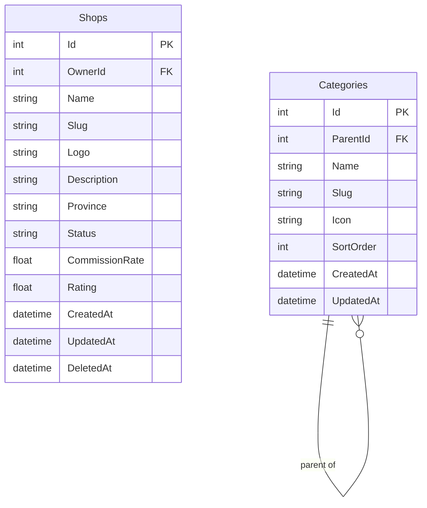
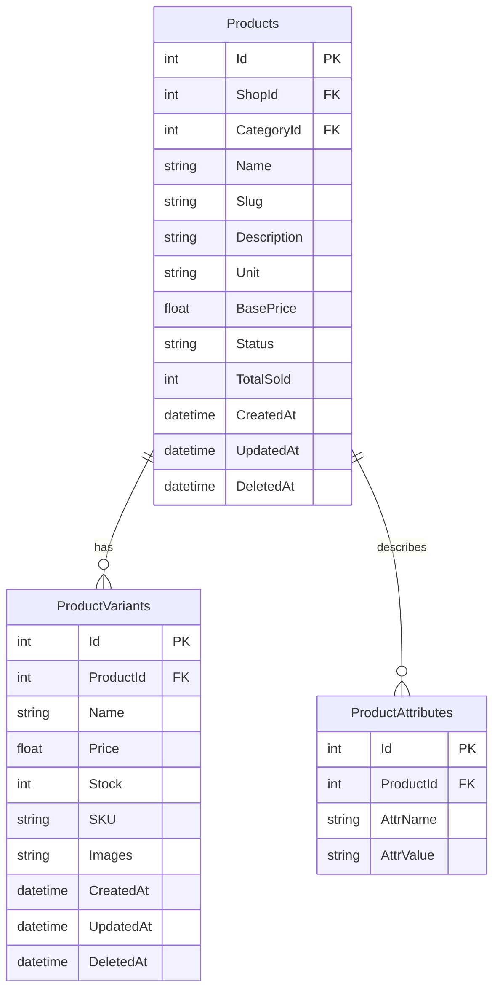
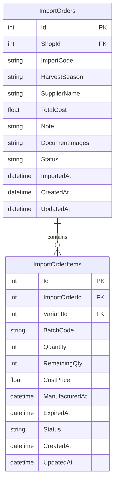
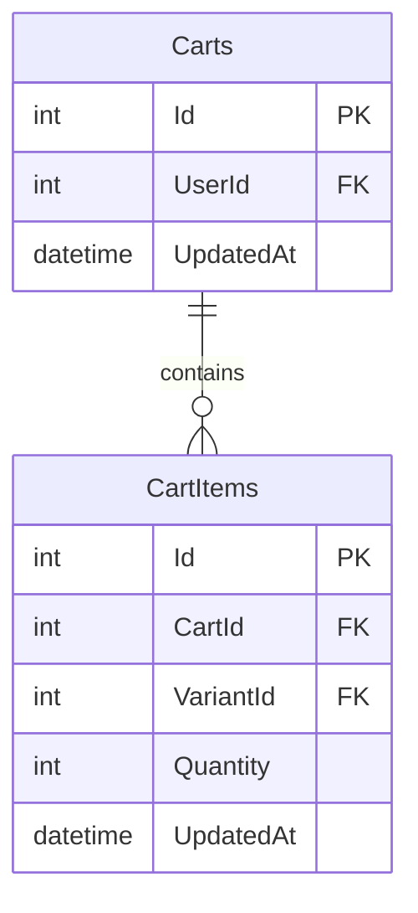
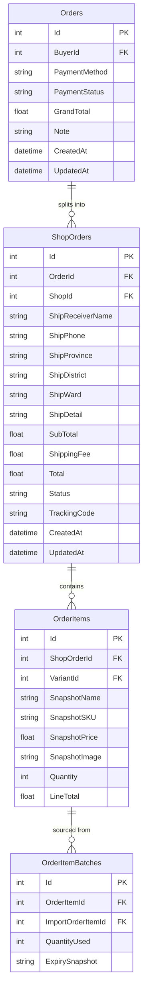
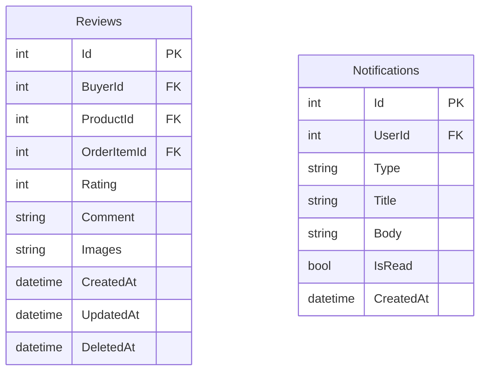

# ERD — Sàn Thương Mại Điện Tử Nông Sản (Multi-Vendor)

> **Đề tài:** Xây dựng website sàn thương mại điện tử đa người bán sử dụng ASP.NET Core và React.js  
> **Phạm vi:** Sản phẩm nông sản (mứt, hạt, kẹo, cà phê, trà...) — định hướng nhà vườn  
> **Tổng số bảng:** 18 bảng chia 8 nhóm | **Công nghệ:** SQL Server / PostgreSQL

---

## Nhóm 1 — Người dùng & Địa chỉ

> Quản lý tài khoản toàn hệ thống. Phân biệt vai trò `Buyer` / `Seller` / `Admin` bằng trường `Role`.  
> Địa chỉ lưu riêng để Buyer có sổ địa chỉ nhiều dòng, nhưng đơn hàng sẽ **snapshot** lại địa chỉ, không dùng FK trực tiếp.

**Ghi chú:**
- `Role`: `"Buyer"` | `"Seller"` | `"Admin"` — quyết định giao diện và API được phép gọi
- `IsActive`: Admin có thể khoá tài khoản mà không xoá dữ liệu
- `DeletedAt`: Soft delete — query luôn kèm `WHERE DeletedAt IS NULL`
- `IsDefault`: Địa chỉ mặc định tự động điền khi Buyer checkout

---

## Nhóm 2 — Gian hàng & Danh mục

> Mỗi Seller sở hữu đúng **1 Shop** (nhà vườn). Admin duyệt shop trước khi được phép bán.  
> Danh mục tự quan hệ để hỗ trợ đa cấp: `Cà phê` → `Arabica` → `Arabica rang xay`.

**Ghi chú:**
- `Status`: `"Pending"` → `"Active"` | `"Suspended"` — Admin duyệt mới cho bán
- `CommissionRate`: Tỷ lệ hoa hồng sàn thu, mỗi shop có thể khác nhau (vd: 5%)
- `Province`: Vùng của nhà vườn — lọc theo vùng sản xuất (Đà Lạt, Tây Nguyên...)
- `ParentId NULL`: Danh mục gốc; `SortOrder`: thứ tự hiển thị trên menu

---

## Nhóm 3 — Sản phẩm

> Sản phẩm thuộc về 1 Shop và 1 danh mục. Mỗi sản phẩm có nhiều **biến thể** (khối lượng, đóng gói)  
> và nhiều **thuộc tính** mô tả đặc trưng nông sản (vùng trồng, độ rang, thành phần...).

**Ghi chú:**
- `Unit`: Đơn vị bán — `kg`, `hộp`, `túi`, `gói`, `lọ`... đặc trưng nông sản
- `Stock` trong `ProductVariants`: Tồn kho tổng hợp từ các lô hàng `Active`
- `SKU`: Mã định danh nội bộ — vd: `CF-ARA-500G`
- `ProductAttributes`: Dạng key-value tự do — vd: `"Vùng trồng"` / `"Cầu Đất – Đà Lạt"`
- `Status`: `"Draft"` | `"Active"` | `"OutOfStock"` | `"Banned"`

---

## Nhóm 4 — Nhập hàng & Lô hàng

> Phản ánh đúng thực tế nhà vườn: **1 chuyến nhập = 1 phiếu** gồm nhiều sản phẩm cùng vụ thu hoạch.  
> Mỗi dòng `ImportOrderItems` có hạn sử dụng và giá vốn riêng.  
> Hệ thống xuất kho theo nguyên tắc **FEFO** (First Expired, First Out).

**Ghi chú:**
- `ImportCode`: Mã phiếu tự sinh — vd: `IMP-2025-0601`
- `HarvestSeason`: Tên vụ mùa — vd: `"Vụ hè 2025"`, `"Thu hoạch tháng 11"`
- `DocumentImages`: JSON array URL ảnh chứng từ: hoá đơn VAT, chứng nhận VietGAP...
- `Status` phiếu: `"Draft"` | `"Confirmed"` — chỉ khi `Confirmed` mới cộng vào tồn kho
- `ExpiredAt`: Hạn sử dụng từng dòng (mứt 6 tháng, cà phê 12 tháng — khác nhau trong cùng 1 phiếu)
- `RemainingQty`: Trừ dần mỗi khi xuất hàng; = 0 thì lô `OutOfStock`
- `Status` lô: `"Active"` | `"NearExpiry"` | `"Expired"` | `"OutOfStock"` — background job cập nhật hàng ngày
- `CostPrice`: Giá vốn đơn vị — dùng tính lợi nhuận thực của Seller

---

## Nhóm 5 — Giỏ hàng

> Mỗi Buyer có đúng **1 giỏ hàng** tồn tại xuyên suốt (không reset sau khi đóng trình duyệt).  
> Giỏ hàng có thể chứa sản phẩm từ nhiều shop khác nhau.

**Ghi chú:**
- `VariantId`: Liên kết tới `ProductVariants` — giỏ hàng lưu biến thể cụ thể, không chỉ sản phẩm
- Khi checkout: so sánh `Quantity` với `ProductVariants.Stock` để kiểm tra còn hàng
- `UpdatedAt`: Cập nhật mỗi khi thêm/bớt — hiển thị "Cập nhật lúc..."

---

## Nhóm 6 — Đơn hàng

> **Thiết kế 2 tầng** để giải quyết bài toán Multi-vendor:  
> `Orders` = phiên checkout của Buyer (1 lần bấm đặt hàng).  
> `ShopOrders` = đơn con tách theo từng shop — Seller chỉ thấy và thao tác phần của mình.  
> `OrderItemBatches` ghi nhận lô hàng nào được xuất (theo FEFO).

**Ghi chú:**
- `ShipReceiverName` → `ShipDetail`: **Snapshot địa chỉ** — lưu thẳng lúc checkout, không dùng FK tới `Addresses`
- `SnapshotName`, `SnapshotPrice`, `SnapshotSKU`, `SnapshotImage`: **Snapshot sản phẩm** — Seller tăng giá sau không ảnh hưởng đơn cũ
- `Status` của `ShopOrders`: `"Pending"` → `"Confirmed"` → `"Shipping"` → `"Delivered"` | `"Cancelled"`
- `TrackingCode`: Mã vận đơn shipper — Seller điền khi giao hàng
- `LineTotal` = `SnapshotPrice × Quantity`
- `GrandTotal` = cộng dồn `Total` của tất cả `ShopOrders` trong phiên
- `ExpirySnapshot`: Lưu hạn sử dụng lô lúc xuất — dùng để in phiếu giao hàng

---

## Nhóm 7 — Thanh toán & Doanh thu

> `Payments` lưu giao dịch thanh toán để đối soát với cổng thanh toán.  
> `PlatformRevenue` là nguồn dữ liệu chính cho dashboard Admin — tự sinh khi `ShopOrders` hoàn thành.

```mermaid
erDiagram
  Payments {
    int       Id              PK
    int       OrderId         FK
    string    Method
    string    Status
    float     Amount
    string    TransactionId
    string    GatewayResponse
    datetime  PaidAt
    datetime  CreatedAt
    datetime  UpdatedAt
  }

  PlatformRevenue {
    int       Id              PK
    int       ShopOrderId     FK
    int       ShopId          FK
    float     OrderTotal
    float     CommissionRate
    float     CommissionAmount
    string    Status
    datetime  CreatedAt
  }
```

**Ghi chú:**
- `Method`: `"COD"` | `"VNPay"` | `"MoMo"`
- `TransactionId`: Mã giao dịch từ cổng thanh toán — dùng để đối soát khi có khiếu nại
- `GatewayResponse`: Toàn bộ JSON response từ cổng — lưu để debug tranh chấp
- `CommissionRate`: **Snapshot** từ `Shops.CommissionRate` lúc đó — Admin thay đổi rate sau không ảnh hưởng lịch sử
- `CommissionAmount` = `OrderTotal × CommissionRate` — doanh thu thực tế của sàn
- `Status` doanh thu: `"Pending"` (đơn chưa giao) | `"Settled"` (đã chốt, sàn nhận tiền)
- **Dashboard Admin**: `SUM(CommissionAmount) GROUP BY tháng / shop`
- **Dashboard Seller**: Doanh thu ròng = `Total − CommissionAmount`; Lợi nhuận = Doanh thu ròng − `(CostPrice × Quantity)`

---

## Nhóm 8 — Đánh giá & Thông báo

> `Reviews` chỉ cho phép Buyer đã mua mới được đánh giá — xác thực qua `OrderItemId` (verified purchase).  
> `Notifications` lưu thông báo hệ thống: sắp hết hạn lô hàng, đơn hàng mới, thanh toán thành công...

**Ghi chú:**
- `OrderItemId`: Liên kết dòng đơn hàng đã mua — đảm bảo **verified purchase**, mỗi `OrderItem` chỉ review 1 lần
- `Rating`: 1–5 sao — tổng hợp lên `Products.Rating` và `Shops.Rating`
- `DeletedAt` của Reviews: Admin có thể ẩn đánh giá vi phạm mà không mất dữ liệu
- `Type` của Notifications: `"OrderNew"` | `"OrderDelivered"` | `"BatchNearExpiry"` | `"PaymentSuccess"` | `"ReviewReceived"`
- `IsRead`: Đánh dấu đã đọc — hiển thị badge số thông báo chưa đọc

---

## Tổng quan 18 bảng

| # | Nhóm | Bảng | Số bảng |
|---|------|------|---------|
| 1 | Người dùng & Địa chỉ | `Users`, `Addresses` | 2 |
| 2 | Gian hàng & Danh mục | `Shops`, `Categories` | 2 |
| 3 | Sản phẩm | `Products`, `ProductVariants`, `ProductAttributes` | 3 |
| 4 | Nhập hàng & Lô hàng | `ImportOrders`, `ImportOrderItems` | 2 |
| 5 | Giỏ hàng | `Carts`, `CartItems` | 2 |
| 6 | Đơn hàng | `Orders`, `ShopOrders`, `OrderItems`, `OrderItemBatches` | 4 |
| 7 | Thanh toán & Doanh thu | `Payments`, `PlatformRevenue` | 2 |
| 8 | Đánh giá & Thông báo | `Reviews`, `Notifications` | 2 |
| | **Tổng** | | **18** |
