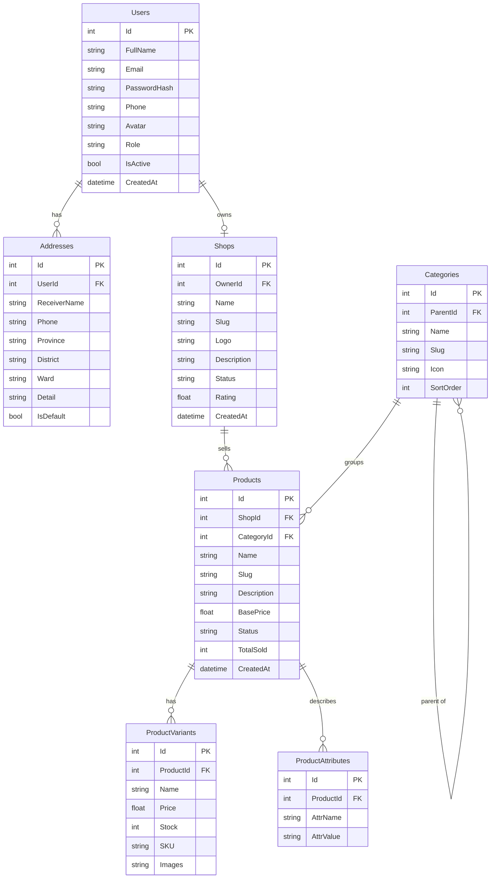
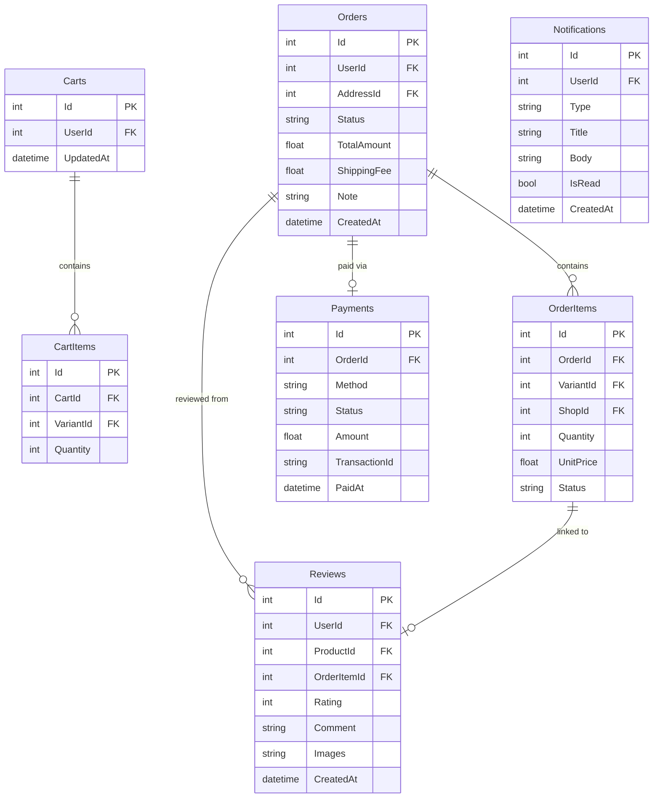

## 1. Sơ đồ User, Shop và Product

```mermaid
erDiagram
  Users {
    int Id PK
    string FullName
    string Email
    string PasswordHash
    string Phone
    string Avatar
    string Role
    bool IsActive
    datetime CreatedAt
  }
  Addresses {
    int Id PK
    int UserId FK
    string ReceiverName
    string Phone
    string Province
    string District
    string Ward
    string Detail
    bool IsDefault
  }
  Shops {
    int Id PK
    int OwnerId FK
    string Name
    string Slug
    string Logo
    string Description
    string Status
    float Rating
    datetime CreatedAt
  }
  Categories {
    int Id PK
    int ParentId FK
    string Name
    string Slug
    string Icon
    int SortOrder
  }
  Products {
    int Id PK
    int ShopId FK
    int CategoryId FK
    string Name
    string Slug
    string Description
    float BasePrice
    string Status
    int TotalSold
    datetime CreatedAt
  }
  ProductVariants {
    int Id PK
    int ProductId FK
    string Name
    float Price
    int Stock
    string SKU
    string Images
  }
  ProductAttributes {
    int Id PK
    int ProductId FK
    string AttrName
    string AttrValue
  }

  Users ||--o{ Addresses : "has"
  Users ||--o| Shops : "owns"
  Shops ||--o{ Products : "sells"
  Categories ||--o{ Categories : "parent of"
  Categories ||--o{ Products : "groups"
  Products ||--o{ ProductVariants : "has"
  Products ||--o{ ProductAttributes : "describes"
```

---

## 2. Sơ đồ Order, Payment và Review

```mermaid
erDiagram
  Carts {
    int Id PK
    int UserId FK
    datetime UpdatedAt
  }
  CartItems {
    int Id PK
    int CartId FK
    int VariantId FK
    int Quantity
  }
  Orders {
    int Id PK
    int UserId FK
    int AddressId FK
    string Status
    float TotalAmount
    float ShippingFee
    string Note
    datetime CreatedAt
  }
  OrderItems {
    int Id PK
    int OrderId FK
    int VariantId FK
    int ShopId FK
    int Quantity
    float UnitPrice
    string Status
  }
  Payments {
    int Id PK
    int OrderId FK
    string Method
    string Status
    float Amount
    string TransactionId
    datetime PaidAt
  }
  Reviews {
    int Id PK
    int UserId FK
    int ProductId FK
    int OrderItemId FK
    int Rating
    string Comment
    string Images
    datetime CreatedAt
  }
  Notifications {
    int Id PK
    int UserId FK
    string Type
    string Title
    string Body
    bool IsRead
    datetime CreatedAt
  }

  Carts ||--o{ CartItems : "contains"
  Orders ||--o{ OrderItems : "contains"
  Orders ||--o| Payments : "paid via"
  Orders ||--o{ Reviews : "reviewed from"
  OrderItems ||--o| Reviews : "linked to"
```