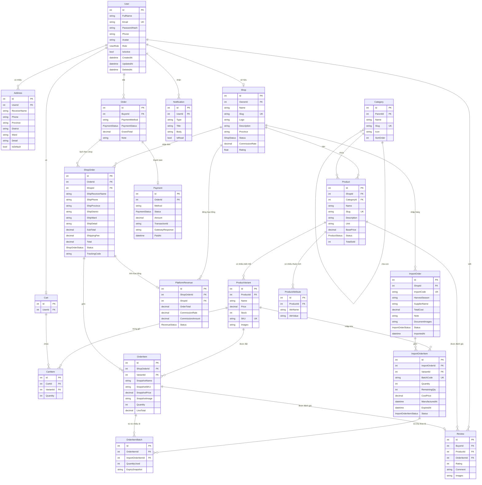

# ERD — Sàn TMĐT Nông sản đa gian hàng

## Sơ đồ quan hệ thực thể (Mermaid)

---

## Bảng tổng hợp quan hệ

| Quan hệ | Bảng A | Bảng B | Loại | FK nằm ở |
|----------|--------|--------|------|----------|
| User → Address | User | Address | 1 - N | Address.UserId |
| User → Shop | User | Shop | 1 - 0..1 | Shop.OwnerId |
| User → Cart | User | Cart | 1 - 0..1 | Cart.UserId |
| User → Order | User | Order | 1 - N | Order.BuyerId |
| User → Review | User | Review | 1 - N | Review.BuyerId |
| User → Notification | User | Notification | 1 - N | Notification.UserId |
| Category → Category | Category | Category | 1 - N (tự tham chiếu) | Category.ParentId |
| Category → Product | Category | Product | 1 - N | Product.CategoryId |
| Shop → Product | Shop | Product | 1 - N | Product.ShopId |
| Shop → ImportOrder | Shop | ImportOrder | 1 - N | ImportOrder.ShopId |
| Shop → ShopOrder | Shop | ShopOrder | 1 - N | ShopOrder.ShopId |
| Shop → PlatformRevenue | Shop | PlatformRevenue | 1 - N | PlatformRevenue.ShopId |
| Product → ProductVariant | Product | ProductVariant | 1 - N | ProductVariant.ProductId |
| Product → ProductAttribute | Product | ProductAttribute | 1 - N | ProductAttribute.ProductId |
| Product → Review | Product | Review | 1 - N | Review.ProductId |
| ProductVariant → CartItem | ProductVariant | CartItem | 1 - N | CartItem.VariantId |
| ProductVariant → ImportOrderItem | ProductVariant | ImportOrderItem | 1 - N | ImportOrderItem.VariantId |
| ProductVariant → OrderItem | ProductVariant | OrderItem | 1 - N | OrderItem.VariantId |
| Cart → CartItem | Cart | CartItem | 1 - N | CartItem.CartId |
| ImportOrder → ImportOrderItem | ImportOrder | ImportOrderItem | 1 - N | ImportOrderItem.ImportOrderId |
| ImportOrderItem → OrderItemBatch | ImportOrderItem | OrderItemBatch | 1 - N | OrderItemBatch.ImportOrderItemId |
| Order → ShopOrder | Order | ShopOrder | 1 - N | ShopOrder.OrderId |
| Order → Payment | Order | Payment | 1 - 0..1 | Payment.OrderId |
| ShopOrder → OrderItem | ShopOrder | OrderItem | 1 - N | OrderItem.ShopOrderId |
| ShopOrder → PlatformRevenue | ShopOrder | PlatformRevenue | 1 - 0..1 | PlatformRevenue.ShopOrderId |
| OrderItem → OrderItemBatch | OrderItem | OrderItemBatch | 1 - N | OrderItemBatch.OrderItemId |
| OrderItem → Review | OrderItem | Review | 1 - 0..1 | Review.OrderItemId |

**Tổng cộng: 18 Entity, 27 quan hệ**
