# Mô tả nghiệp vụ Use Case — Sàn thương mại điện tử nông sản

> **Đề tài:** Xây dựng website sàn thương mại điện tử đa người bán sử dụng ASP.NET Core và React.js  
> **Phạm vi:** Sản phẩm nông sản (mứt, hạt, kẹo, cà phê, trà...) — định hướng nhà vườn  

---

## 1. Sơ đồ Tổng quan toàn hệ thống

  
   
  <em>Luồng tương tác tổng quát giữa các tác nhân (Buyer, Seller, Admin) và hệ thống</em>

---

## 2. Actor: Buyer (Người mua)

  

### Mô tả chi tiết chức năng của Người mua

**Tài khoản**
* Người mua thực hiện tạo tài khoản mới hoặc đăng nhập vào hệ thống để bắt đầu sử dụng đầy đủ các tính năng mua sắm và thanh toán của sàn.
* Cho phép người mua tự cập nhật và quản lý các thông tin cá nhân cốt lõi bao gồm họ tên, số điện thoại liên hệ và ảnh đại diện.
* Hệ thống cung cấp sổ địa chỉ cá nhân để người mua chủ động thêm mới, chỉnh sửa thông tin hoặc xóa các địa chỉ nhận hàng khác nhau.

**Mua sắm**
* Người mua có thể tìm kiếm nhanh các mặt hàng nông sản dựa trên từ khóa tự do, phân loại theo danh mục sản phẩm hoặc lọc theo từng vùng trồng đặc trưng.
* Hệ thống hiển thị đầy đủ thông tin chi tiết của một sản phẩm bao gồm mô tả chi tiết, các biến thể lựa chọn, thông số thuộc tính và các đánh giá thực tế.
* Người mua thực hiện chọn chính xác biến thể sản phẩm (khối lượng, quy cách đóng gói) và số lượng mong muốn để thêm vào giỏ hàng cá nhân.

**Đặt hàng & Thanh toán**
* Người mua tiến hành kiểm tra lại toàn bộ giỏ hàng, chọn địa chỉ giao hàng phù hợp từ sổ địa chỉ, thiết lập phương thức thanh toán để hoàn tất lệnh đặt hàng.
* Hỗ trợ tích hợp cổng thanh toán trực tuyến giúp người mua thực hiện trả tiền ngay.
* Người mua có quyền theo dõi chi tiết toàn bộ trạng thái vận chuyển của đơn hàng và thực hiện hủy đơn nếu chưa bắt đầu xử lý đóng gói.

**Đánh giá**
* Sau khi đơn hàng được giao thành công, người mua có quyền để lại phản hồi về sản phẩm thông qua số điểm sao, nội dung nhận xét bằng văn bản kèm theo hình ảnh thực tế.

---

## 3. Actor: Seller (Nhà vườn / Người bán)

  

### Mô tả chi tiết chức năng của Nhà vườn

**Gian hàng**
* Đại diện các nhà vườn thực hiện gửi thông tin đăng ký mở gian hàng kinh doanh trên sàn và hồ sơ này bắt buộc phải chờ phía Quản trị viên phê duyệt trước khi đi vào hoạt động.
* Nhà vườn chủ động quản lý và cập nhật lại bộ nhận diện thương hiệu của shop bao gồm hình ảnh logo, phần mô tả giới thiệu.

**Quản lý sản phẩm**
* Cho phép nhà vườn tạo mới các sản phẩm nông sản bằng cách khai báo toàn bộ thông tin tổng quan, thiết lập các biến thể (giá cả, tồn kho) và các thuộc tính kỹ thuật đi kèm.
* Nhà vườn có thể nhanh chóng chuyển đổi trạng thái hoạt động của sản phẩm để ẩn hoặc hiển thị lại mặt hàng đó trên giao diện tìm kiếm của người mua.

**Nhập hàng & Kho**
* Hệ thống hỗ trợ nhà vườn quản lý kho theo từng đợt thu hoạch thực tế, cho phép ghi nhận việc tăng số lượng tồn kho của nhiều loại nông sản cùng một vụ mùa trong một phiếu nhập duy nhất.
* Chức năng tự động rà soát dữ liệu hạn sử dụng trong kho và liệt kê danh sách các lô nông sản sắp hết hạn (trong vòng 30 ngày) để nhà vườn có kế hoạch xả hàng hoặc xử lý.

**Xử lý đơn hàng**
* Nhà vườn tiếp nhận danh sách các đơn hàng đổ về riêng cho shop mình, thực hiện xác nhận chuẩn bị hàng và cập nhật từng bước trạng thái đóng gói, giao nhận.

**Doanh thu & Lợi nhuận**
* Cung cấp hệ thống biểu đồ báo cáo trực quan giúp nhà vườn theo dõi tổng doanh thu, tính toán phần lợi nhuận thực tế sau khi trừ giá vốn và khấu trừ khoản phí hoa hồng đã trả cho sàn.

---

## 4. Actor: Admin (Quản trị viên sàn)

  

### Mô tả chi tiết chức năng của Quản trị viên

**Quản lý gian hàng**
* Quản trị viên có trách nhiệm thẩm định các thông tin pháp lý, nguồn gốc của các yêu cầu mở shop mới để đưa ra quyết định phê duyệt hoặc từ chối đơn đăng ký.
* Hệ thống cho phép điều chỉnh linh hoạt tỷ lệ chiết khấu/hoa hồng khấu trừ riêng cho từng gian hàng cụ thể dựa trên quy mô doanh số hoặc thỏa thuận ký kết.
* Áp dụng chế tài xử phạt bằng cách khóa tạm thời hoặc vĩnh viễn các gian hàng có hành vi gian lận, vi phạm chính sách và mở khóa lại khi đã khắc phục xong sai phạm.

**Quản lý người dùng**
* Quản trị viên thực hiện vô hiệu hóa quyền truy cập của các tài khoản người dùng cố tình vi phạm các điều khoản quy định chung của nền tảng.
* Có quyền can thiệp ẩn bỏ các bài đánh giá sản phẩm mang tính chất bôi nhọ, chứa ngôn từ thô tục, spam quảng cáo hoặc cố tình cung cấp sai sự thật.

**Danh mục & Sản phẩm**
* Quản trị viên toàn quyền xây dựng, chỉnh sửa cấu trúc và sắp xếp vị trí hiển thị của cây danh mục nông sản đa cấp trên phạm vi toàn sàn.
* Thực hiện gỡ bỏ hoàn toàn hoặc cấm hiển thị (banned) đối với các mặt hàng nông sản giả mạo, nội dung quảng cáo sai lệch hoặc thuộc danh mục cấm kinh doanh.

**Báo cáo doanh thu sàn**
* Cung cấp số liệu tổng hợp về nguồn thu nhập của sàn từ phí hoa hồng, cho phép lọc phân tích chi tiết hiệu quả kinh doanh theo thời gian và theo từng đối tác gian hàng.

**Đơn hàng & Khiếu nại**
* Đóng vai trò là bên thứ ba trung gian đứng ra tiếp nhận, thẩm định bằng chứng và đưa ra phán quyết giải quyết các tranh chấp phát sinh giữa người mua và nhà vườn liên quan đến chất lượng hàng hóa hoặc hoàn tiền.